## 01-Basics

This folder contains hands-on Git basics.

## Commands practiced

- `git init ` - Initialized repository
- `git status ` - Checks current status
- `git add <file> ` - Stages file for commit
- `git commit -m "<message>" ` - Commits staged files
- `git log ` / `git log --oneline` - View commit history
- `git diff ` - View difference between changes
- Optional:
    - `git mv <file> ` - Rename a file
    - `git rm <file> ` - Remove a file

## Tasks and Output:

<ol>
<li> Initialize a repository </li>
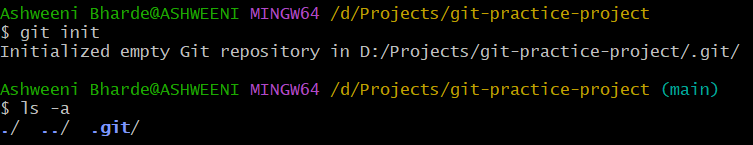

 

<li> Check current status of repo </li>
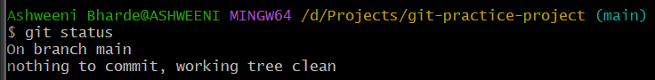

 

<li> Create a file named hello.txt </li>
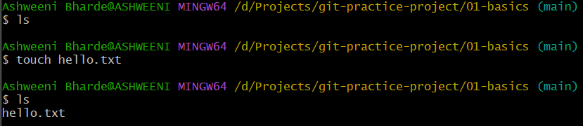

 

<li> Add the content "Hello Git." to hello.txt </li>
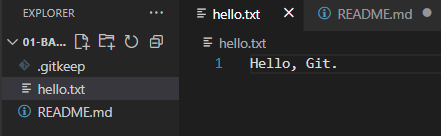

 

<li> Add hello.txt to staging area </li>
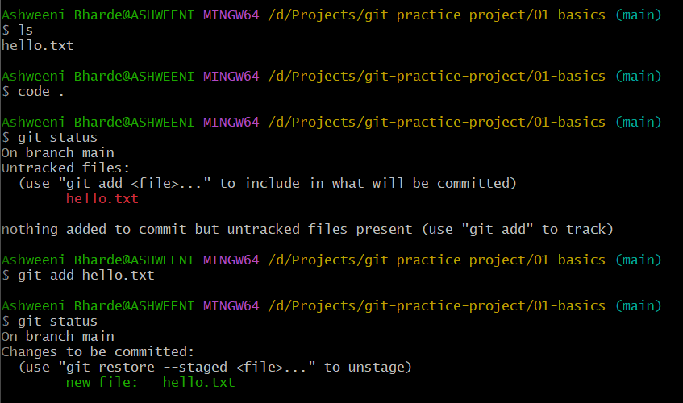

 

<li> Commit staged changes with message </li>
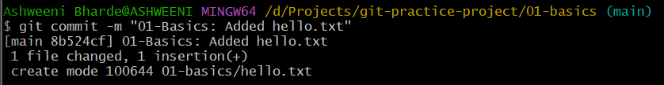

 

<li> View commit history </li>
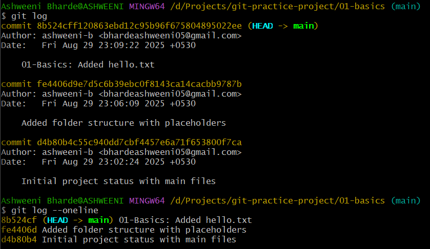

 

<li> Modify hello.txt with a text </li>
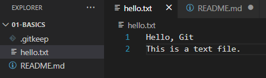

 

<li> See changes made to files </li>
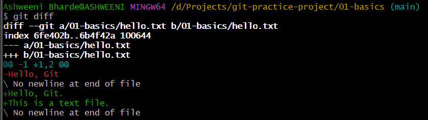

 

<li> Create a temp.txt file </li>
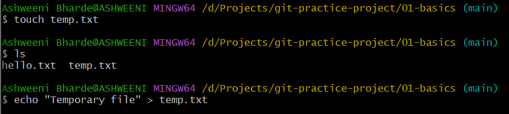

 

<li> Add the content "Temporary file" in temp.txt </li>
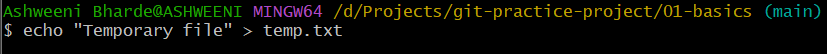

 

<li> Add and commit temp.txt </li>
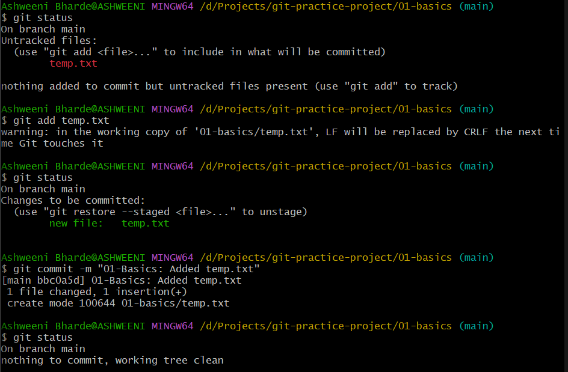

 

<li> Rename temp.txt with renamed.txt </li>
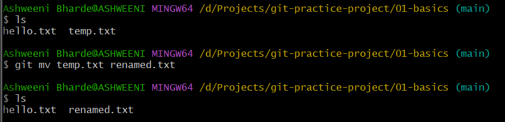

 

<li> Remove temp.txt </li>
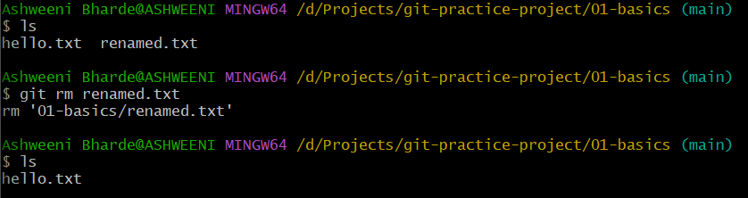

 

</ol>