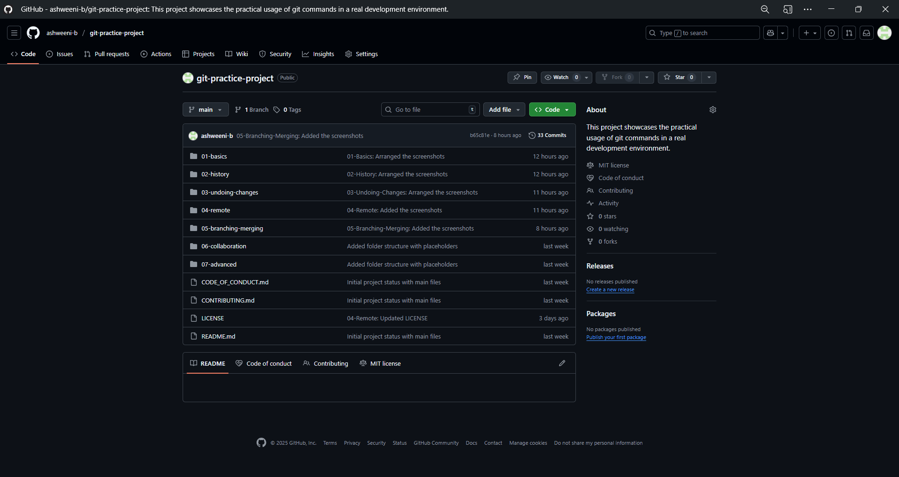
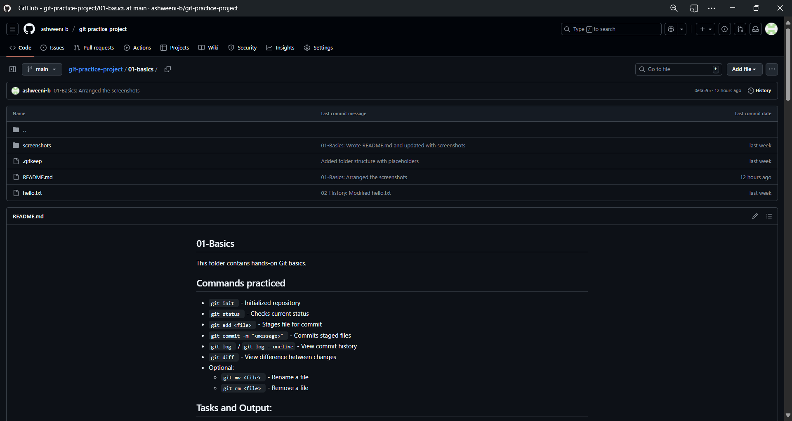

## Git Practice Project

A structured practice project to learn and demonstrate Git workflows - from basics to advanced.

### Why this Project?

- This project is designed to learn, practice and revise Git systematically.  
- It covers real-world Git workflows like branching, merging, undoing changes, collaboration, and advanced commands.  
- The goal is to build hands-on Git experience that's directly useful in team projects and interviews.

### Folder Structure

git-practice-project  
│_ 01-basics  
│_ 02-history  
│_ 03-undoing-changes  
│_ 04-remote  
│_ 05-branching-merging  
│_ 06-collaboration  
│_ 07-advanced  
│_ CONTRIBUTING.md  
│_ CODE_OF_CONDUCT.md  
│_ LICENSE  
│_ README.md

### Topics Covered

* Git basics (init, config, add, commit, log)
* Navigating history
* Undoing changes (checkout, reset, revert, clean)
* Working with remote (push, pull, fetch, clone)
* Branching & merging
* Collaboration workflows (fork, clone, PRs, reviews)
* Advanced Git (stash, cherry-pick, rebase, tags, etc.)

### How to Use this Repo

1. Clone the repo in your local system using,
<code> git clone https://github.com/ashweeni-b/git-practice-project.git </code>

2. Navigate into a folder (01-basics, 02-history, etc.)
3. Each folder has its own README.md with commands, tasks and outputs of the tasks.

### Demo

### Contributing
See [CONTRIBUTING.md](./CONTRIBUTING.md)

### Code of Conduct
See [CODE_OF_CONDUCT.md](./CODE_OF_CONDUCT.md)

### License
This project is licensed under the MIT Licnese - see the [LICENSE](./LICENSE) file for details.
